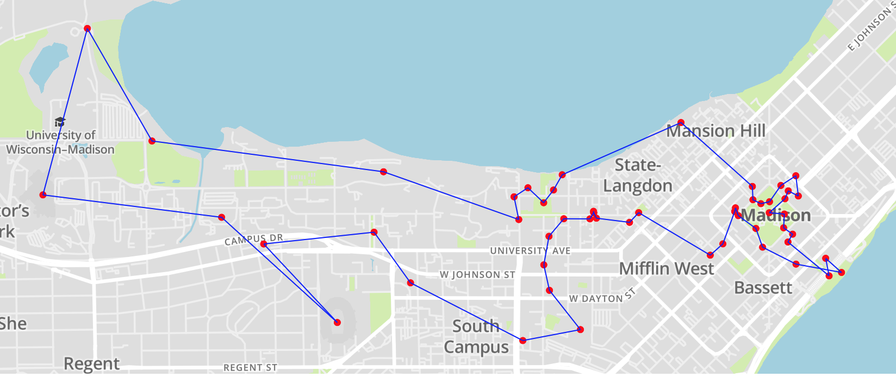

# Badgers On Parade Met TSP

[**Notebook viewer**](http://nbviewer.jupyter.org/urls/asong4211.github.io/Badgers-On-Parade-Met-TSP/solve.ipynb)

Recently, my school (University of Wisconsin-Madison) installed multiple badgers statues across the campus as a public art event. All the statues are spread across the campus and downtown Madison area, as well as some outside of the downtown Madison area.

I am interested in finding a route to visit all of the badger statues. This problem can be formulated as a travel salesman problem (TSP), where I will start at one of the statue, and tour all of the statues, and come back to where I started. However, the TSP problem is known to be NP-Hard, where solving them would take n! time complexity. In this case, there is a total of 54 statues, which would take about 2.3e71, or about 15 days to just find the optimal solution. In this project, I try to solve this problem by using two of the most popular relaxation method for TSP: Subtour Elimination method and Miller-Tucker-Zemlin formulation.

Here is the map of the final solution (interactive map can be found in the notebook):

**Notes**: For some reason, github's jupyter notebook preview doesn't work and nbviewer only renders one graph. So to run them, one has to clone the file and run it. [here](http://nbviewer.jupyter.org/urls/asong4211.github.io/Badgers-On-Parade-Met-TSP/solve.ipynb):

## Packages
- Julia: I used Julia primarily for this project, with JuMP, which helps formulate the problem in Julia, and I tried out with two different NonConvex Solvers: Cbc and Gurobi, both of them perform about the same; Gurobi is only free if you can have a student license while Cbc is free for everyone to use. I use PyCall in Julia just to use the Python Plotly interactive map since I can't find an easy way to use Plotly's map in Julia.
- Python: I also used Python just to get the distances between all the statues. I used the Google Distance Matrix API to calculate the walking distance between all the statues. It returns a n by n distance matrix, and stores it in a csv file, which then got used in my Julia file.

## Files:
- `solve.ipynb`: the julia notebook that contain all the mathematical formulations and all the codes to solve the problem
- `distance_graph`: the python notebook that calculates the distance matrix
- `distance.csv`: the distance matrix in csv format, calculated using the distance_graph 
- `location.csv`: the lon and lat of all the badger statues, obtained from buckyonparade.com
- `final-solution.md`: final solutions
